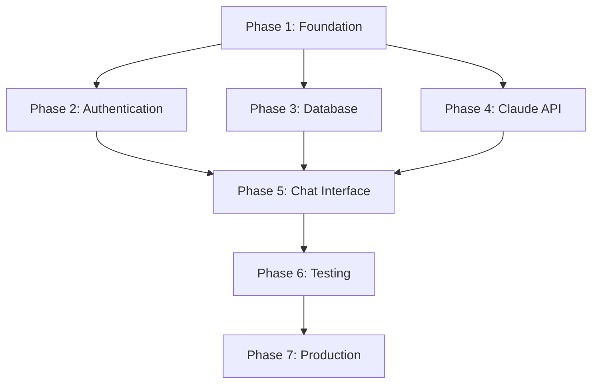

# ChatGPT Clone Development Plan

## Overview
This document breaks down the development of our ChatGPT clone into manageable, testable tasks following the mandatory development cycle outlined in CLAUDE.md. Each phase includes specific deliverables and leverages specialized research agents.

## Specialized Agent Utilization
- **chat-ui-researcher**: Chat UI patterns, streaming implementations, accessibility
- **claude-api-researcher**: Claude API integration, streaming, error handling
- **nextjs-testing-architect**: Testing strategies, mocking patterns, CI/CD
- **supabase-auth-researcher**: Authentication flows, real-time features, testing

## Development Phases

### Phase 1: Foundation & Research
**Goal**: Establish project foundation and gather research for informed implementation

#### Task 1.1: Project Initialization
- [ ] Initialize Next.js 14 project with TypeScript
- [ ] Configure Tailwind CSS
- [ ] Set up basic project structure
- [ ] Configure development scripts
- **Testing**: Verify build and dev server startup

#### Task 1.2: Agent-Led Research Phase
- [ ] **chat-ui-researcher**: Research streaming UI patterns and chat interface best practices
- [ ] **claude-api-researcher**: Research Claude API streaming implementation patterns
- [ ] **nextjs-testing-architect**: Research comprehensive testing architecture
- [ ] **supabase-auth-researcher**: Research Google OAuth and authentication patterns
- **Deliverables**: Research reports from each agent informing implementation strategy

#### Task 1.3: Core Interface Definition
- [ ] Define TypeScript interfaces for User, Conversation, Message
- [ ] Define StreamingRequest and StreamingChunk interfaces
- [ ] Create base type definitions file
- **Testing**: TypeScript compilation and interface validation

### Phase 2: Authentication System
**Goal**: Implement secure Google OAuth authentication with Supabase

#### Task 2.1: Supabase Setup
- [ ] Create Supabase project
- [ ] Configure Google OAuth provider
- [ ] Set up database schema (users table)
- [ ] Configure environment variables
- **Testing**: Database connection and OAuth configuration validation

#### Task 2.2: Authentication Implementation
- [ ] Install Supabase auth helpers for Next.js 14
- [ ] Implement auth middleware for protected routes
- [ ] Create login/logout components
- [ ] Set up user session management
- **Testing**: Unit tests for auth components, integration tests for OAuth flow

#### Task 2.3: User Management
- [ ] Implement user profile handling
- [ ] Create user context/provider
- [ ] Handle authentication state changes
- [ ] Add error handling for auth failures
- **Testing**: User state management tests, error scenario validation

### Phase 3: Database Layer
**Goal**: Implement data persistence with proper testing infrastructure

#### Task 3.1: Database Schema Implementation
- [ ] Create conversations and messages tables
- [ ] Set up Row Level Security (RLS) policies
- [ ] Create database migration scripts
- [ ] Set up test database seeding
- **Testing**: Schema validation, RLS policy tests

#### Task 3.2: Data Access Layer
- [ ] Create Supabase client configuration
- [ ] Implement conversation CRUD operations
- [ ] Implement message CRUD operations
- [ ] Add proper error handling and validation
- **Testing**: Unit tests for CRUD operations, integration tests with mocked Supabase

#### Task 3.3: Real-time Subscriptions
- [ ] Implement real-time message subscriptions
- [ ] Handle connection management
- [ ] Add subscription cleanup and error handling
- [ ] Optimize for performance
- **Testing**: Subscription lifecycle tests, connection error handling

### Phase 4: Claude API Integration
**Goal**: Implement streaming AI responses with robust error handling

#### Task 4.1: Claude API Client Setup
- [ ] Install and configure Anthropic SDK
- [ ] Create API client with proper configuration
- [ ] Implement request/response types
- [ ] Add API key validation
- **Testing**: API connection tests, configuration validation

#### Task 4.2: Streaming Implementation
- [ ] Create Next.js API route for chat endpoint
- [ ] Implement streaming response handling
- [ ] Add client-side stream consumption
- [ ] Handle stream interruptions and errors
- **Testing**: Stream handling tests, error scenario validation

#### Task 4.3: Error Handling & Resilience
- [ ] Implement retry strategies with exponential backoff
- [ ] Add rate limiting handling
- [ ] Create fallback mechanisms
- [ ] Add comprehensive error logging
- **Testing**: Error handling tests, rate limiting simulation

### Phase 5: Chat Interface
**Goal**: Build responsive, accessible chat UI with streaming support

#### Task 5.1: Core Chat Components
- [ ] Create message bubble components
- [ ] Implement message input field
- [ ] Add typing indicators and loading states
- [ ] Ensure responsive design
- **Testing**: Component unit tests, responsive behavior tests

#### Task 5.2: Conversation Management
- [ ] Build conversation sidebar
- [ ] Implement new conversation functionality
- [ ] Add conversation deletion
- [ ] Handle conversation title generation
- **Testing**: Conversation management tests, UI interaction tests

#### Task 5.3: Streaming UI Implementation
- [ ] Implement real-time message rendering
- [ ] Add smooth streaming text animation
- [ ] Handle streaming errors gracefully
- [ ] Optimize performance for long conversations
- **Testing**: Streaming UI tests, performance validation

#### Task 5.4: Accessibility & UX Polish
- [ ] Add ARIA labels and screen reader support
- [ ] Implement keyboard navigation
- [ ] Add loading states and error boundaries
- [ ] Optimize for mobile devices
- **Testing**: Accessibility tests, cross-device validation

### Phase 6: Testing & Quality Assurance
**Goal**: Comprehensive testing coverage and CI/CD setup

#### Task 6.1: Unit Testing Suite
- [ ] Set up Jest/Vitest configuration
- [ ] Write unit tests for all components
- [ ] Write unit tests for API functions
- [ ] Write unit tests for utility functions
- **Testing**: Achieve >90% code coverage

#### Task 6.2: Integration Testing
- [ ] Set up testing database
- [ ] Write API route integration tests
- [ ] Write authentication flow tests
- [ ] Write Supabase integration tests
- **Testing**: Full application flow validation

#### Task 6.3: End-to-End Testing
- [ ] Set up Playwright or Cypress
- [ ] Write user journey tests
- [ ] Write error scenario tests
- [ ] Set up CI/CD testing pipeline
- **Testing**: Production-ready validation

### Phase 7: Performance & Production Readiness
**Goal**: Optimize application for production deployment

#### Task 7.1: Performance Optimization
- [ ] Implement message pagination
- [ ] Add virtual scrolling for long conversations
- [ ] Optimize bundle size and loading
- [ ] Add caching strategies
- **Testing**: Performance benchmarks, load testing

#### Task 7.2: Production Configuration
- [ ] Set up production environment variables
- [ ] Configure deployment settings
- [ ] Add monitoring and logging
- [ ] Set up error tracking
- **Testing**: Production deployment validation

#### Task 7.3: Documentation & Deployment
- [ ] Create deployment documentation
- [ ] Add API documentation
- [ ] Create user guide
- [ ] Deploy to production
- **Testing**: Documentation accuracy, deployment verification

## Development Cycle Enforcement

Each task must follow the mandatory development cycle:

1. **Interface Specification**: Define TypeScript interfaces first
2. **Unit Tests**: Implement tests that validate interface contracts
3. **Implementation**: Write code that satisfies specifications
4. **Rigorous Testing**: Thoroughly test before proceeding

## Task Dependencies

## Success Criteria

Each phase completion requires:
- ✅ All TypeScript interfaces defined and validated
- ✅ Unit tests passing with >90% coverage
- ✅ Integration tests passing
- ✅ Code review and quality checks passed
- ✅ Documentation updated
- ✅ Next phase dependencies satisfied

## Risk Mitigation

**Technical Risks:**
- API rate limiting → Implement retry strategies and fallbacks
- Authentication failures → Comprehensive error handling
- Streaming issues → Graceful degradation and reconnection

**Development Risks:**
- Scope creep → Strict adherence to defined interfaces
- Testing gaps → Mandatory test-first development
- Quality issues → Rigorous review process

## Timeline Estimation

- **Phase 1**: 2-3 days (foundation + research)
- **Phase 2**: 3-4 days (authentication)
- **Phase 3**: 3-4 days (database layer)
- **Phase 4**: 4-5 days (Claude API)
- **Phase 5**: 5-6 days (chat interface)
- **Phase 6**: 3-4 days (testing)
- **Phase 7**: 2-3 days (production)

**Total Estimated Duration**: 22-29 days

This plan ensures systematic development with proper testing, leverages specialized agents for domain expertise, and maintains the quality standards outlined in CLAUDE.md.